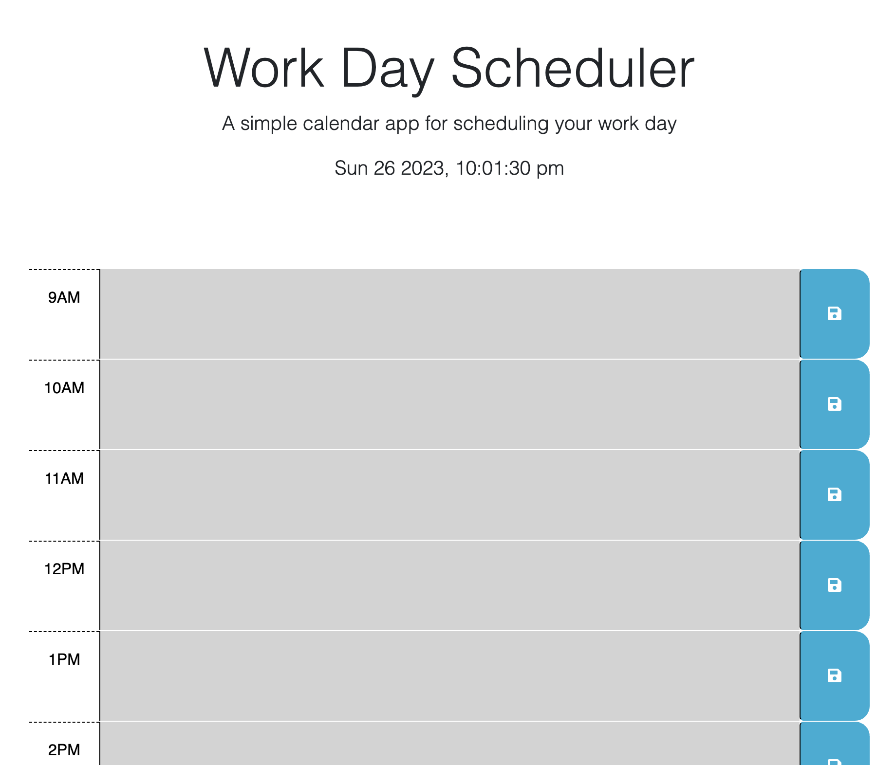

# Work Day Scheduler

## Description
Application that helps to keep track of daily tasks. User is presented with 9-5 work schedule, each hour contain textarea for user to update event/task. Each input is saved in localStorage by using save button. Each hour block style depends on current time. Past hours will turn gray, preset hour will turn red, future hours will turn green. Events can be overwritten and then saved again by clicking save button.

## Technology used
- HTML
- Bootstrap
- CSS
- JavaScript
- jQuery
- Features: font awesome, google fonts, dayjs

## Screenshot

## Link
[Click me](https://abstynent.github.io/work-day-scheduler)